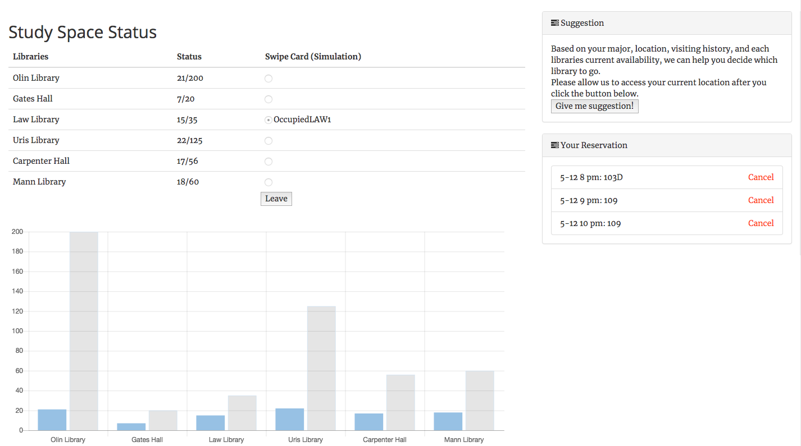

Study Go !
========
#### It's a real-time study space allocation system for Cloud Computing project. The project aims to give the users an easier time to find the best library to study. Students are able to occupy and reserve tables in the libraries based on real-time information about the library availabilities and machine learning recommendation feature. Using the AWS cloud services, this system is scalable and fault-tolerant with fast response time. The project takes form of a web app where students can go online, sign up, and take multiple interactions for booking tables at the library.
#### Our solution stack is Node.js + DynamoDB + AWS Elastic Beanstalk + AWS SageMaker.

## How to run
To run this application on your localhost, you need the following preparation.
### Prerequisites
* [Node.js](https://nodejs.org/en/).
* [Amazon DynamoDB](https://aws.amazon.com/dynamodb/).
* [Amazon SageMaker](https://aws.amazon.com/sagemaker/).
### Installing and setting up
* Install all dependencies using 'npm' command.
  
  ```
  cd locationshare-nodejs
  npm install
  ```
 
* Get an aws access key and configure your credentials.

  To set up, read [[DynamoDB setup guide](https://docs.aws.amazon.com/amazondynamodb/latest/developerguide/SettingUp.DynamoWebService.html#SettingUp.DynamoWebService.GetCredentials)] and [[SageMaker setup guide](https://docs.aws.amazon.com/sagemaker/latest/dg/gs-set-up.html)].
  If you wish to deploy this application on Amazon Elastic Beanstalk, read [[Elastic Beanstalk setup guide](https://docs.aws.amazon.com/elasticbeanstalk/latest/dg/GettingStarted.html)]

* Initialize and feed database.

  ```./feed_db.sh```
  
* To start the server, run:

  ```node app.js```
  
* Now the server is running on 'localhost:3000', you can use 'CTRL+C' command to stop.
## Machine Learning
### Generating Data
Go to "mldata" folder to generate data
* In each library folder, run following command to generate data for traing
  ```
  python <traing file name>
  ```
### Training Data and Deploy Data
In "trainingFile" folder, create a bucket in AWS S3 and use the traing code to train data and deploy model in AWS SageMaker. 

### Sample Code For Incoke Endpoint
In "mlconnectSample", run following command to see sample connection with AWS SageMaker endpoint
```
node app.js
  ```

## Preview
### Index page

### Video information page

## License
[MIT](LICENSE)
